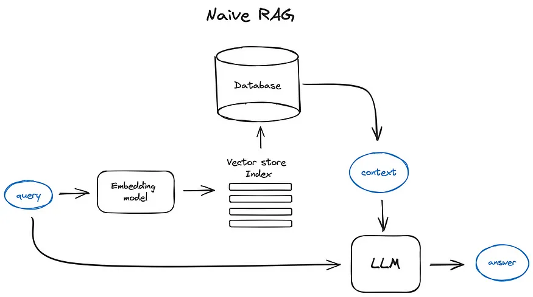

# Các kiến thức và công cụ liên quan đến RAG.

## Các tool hay về RAG.

- LangChain
- LlamaIndex

## Tổng quan RAG.

Dưới đây là cách một hệ thống RAG đơn giản hoạt động trong thực tế: Truy vấn của người dùng được vector hóa bằng cách sử dụng cùng một mô hình Transformer Encoder đã xử lý các đoạn văn bản. Vector truy vấn này sau đó được so khớp với một chỉ mục để truy xuất các đoạn văn bản liên quan nhất. Những đoạn văn bản này được tích hợp vào một prompt được gửi đến một LLM, sau đó LLM sẽ tạo ra một phản hồi dựa trên thông tin ngữ cảnh được cung cấp.

## Advanced RAG Techniques

### 1. **Dense Retrieval**

- **Idea:** Use dense vector representations for retrieval instead of sparse indices.
- **Benefits:** Better generalization, less memory usage, and faster retrieval.
- **Approaches:** Siamese Networks, Dual Encoder Models, and Approximate Nearest Neighbors (ANN) search.

### 2. **Zero-shot Learning**

- **Idea:** Generate responses for unseen queries without fine-tuning on specific data.
- **Benefits:** Improved scalability and adaptability to new domains.
- **Approaches:** Few-shot Learning, Meta-Learning, and Transfer Learning.

### 3. **Multi-turn Conversations**

- **Idea:** Extend RAG to handle multi-turn dialogues for more engaging interactions.
- **Benefits:** Better context understanding and more natural conversations.
- **Approaches:** Dialog State Tracking, Context Management, and Memory Augmented Models.

### 4. **Knowledge Integration**    
- **Idea:** Combine external knowledge sources with RAG for richer responses.
- **Benefits:** Enhanced factual accuracy and domain-specific expertise.
- **Approaches:** Knowledge Graphs, Ontologies, and External Databases.

### 5. **Evaluation Metrics**
- **Idea:** Develop metrics to evaluate the quality of RAG models effectively.
- **Benefits:** Quantitative assessment of model performance and comparison between different models.
- **Metrics:** BLEU, ROUGE, METEOR, and Human Evaluation.

## React Agent

https://viblo.asia/p/toi-da-hoa-suc-manh-cua-llm-bang-viec-su-dung-react-agent-obA46wR9JKv

## How Agentic RAG solves problem with current RAG limitations

> Document -> Chunks-> Vector DB -> Chunk Retrieval (Top K) -> LLM

https://medium.com/@masteringllm/how-agentic-rag-solves-problem-with-current-rag-limitations-4402ef7f8448

